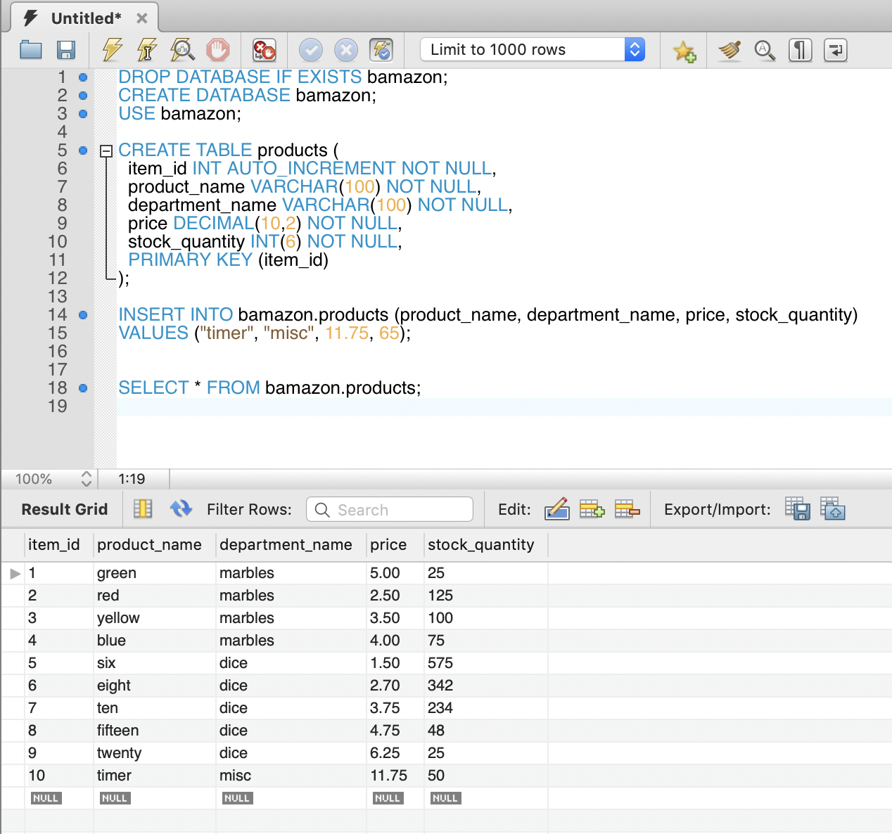
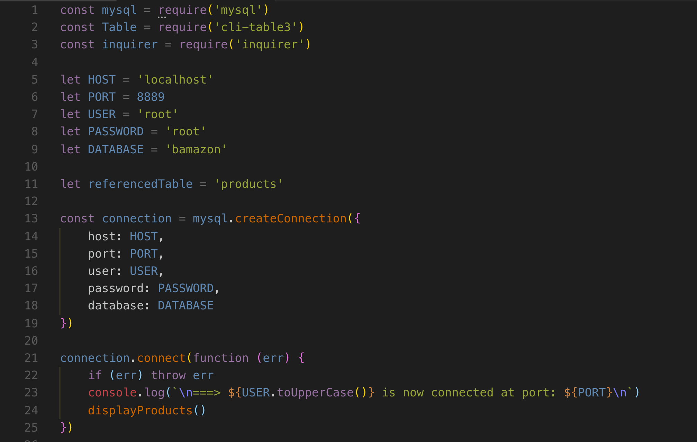
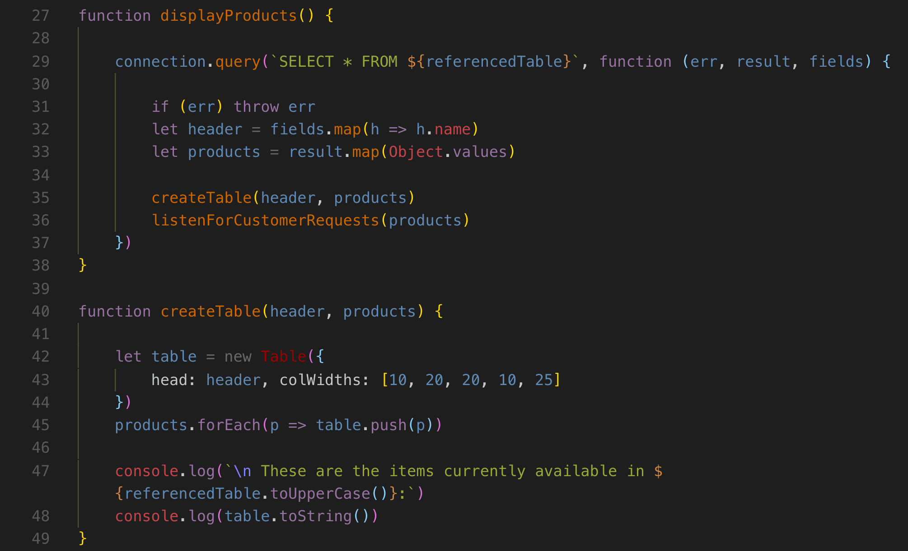
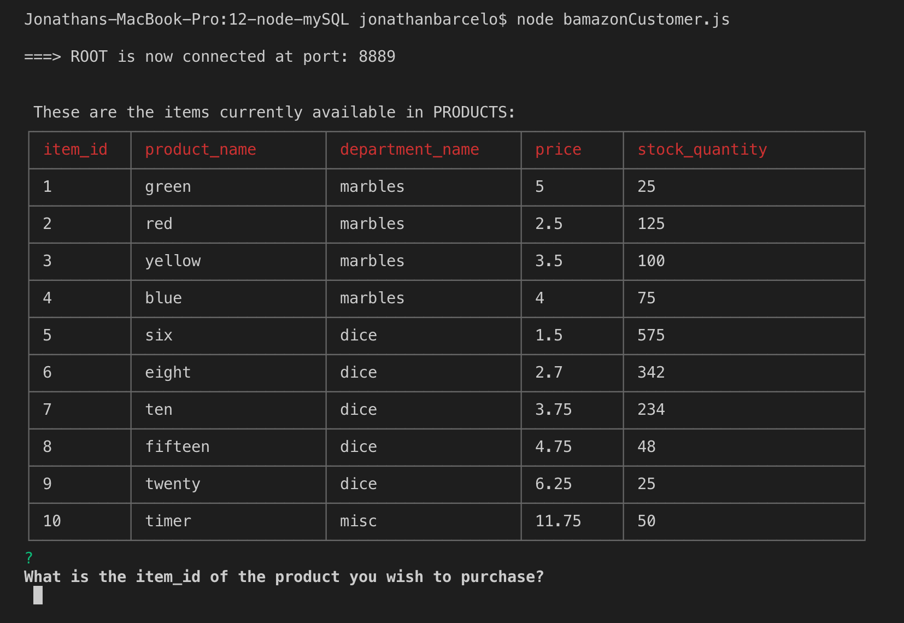
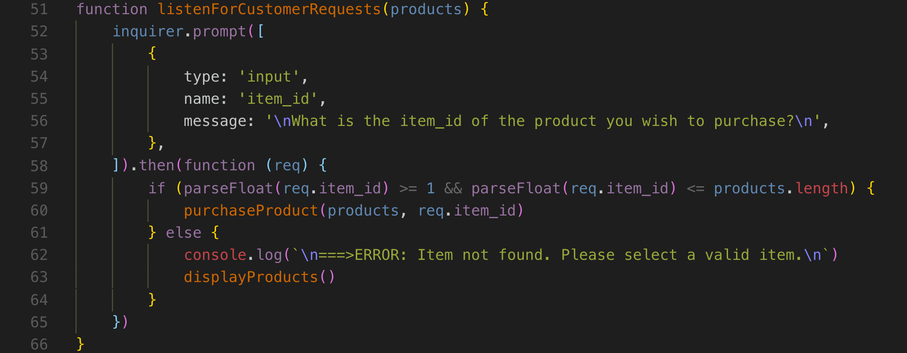
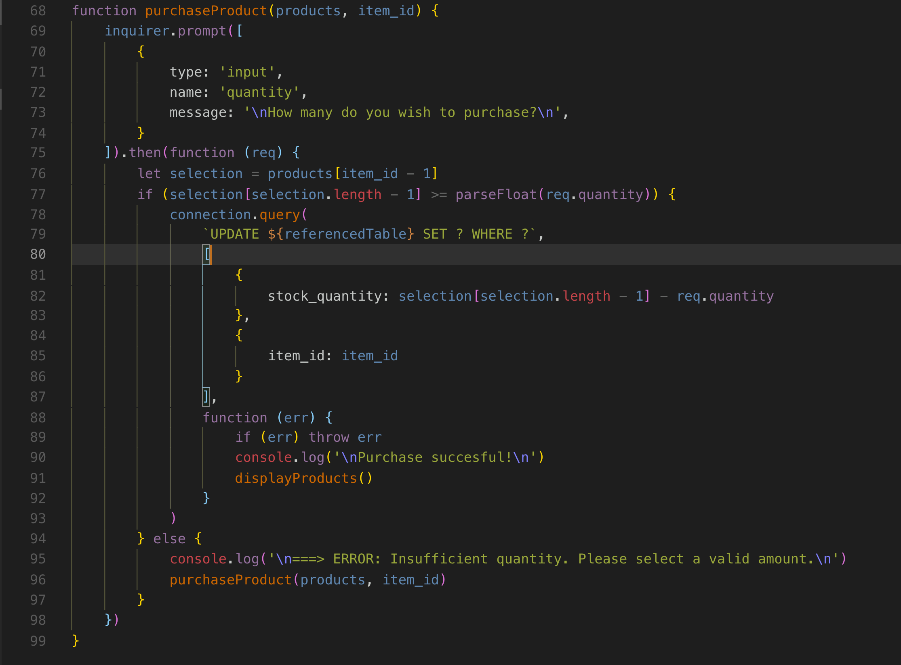
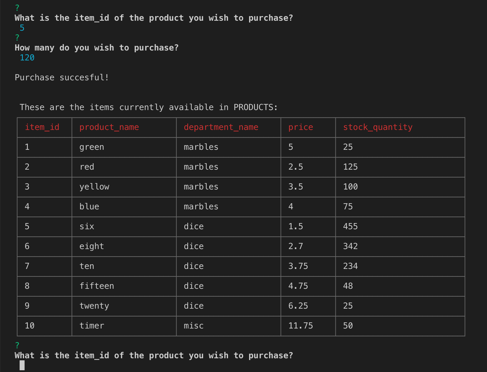

# bamazon!

## What this is.

This is a command line interface application made to test connections to a mySQL database in order to update the data within it with a node application.

The premise is that we are purchasing products from bamazon! A CLI storefront that sells marbles, dice, and other miscellaneous tabletop related toys.

The node application itself requires the following npm modules:

* mysql: connects to mySQL database
* cli-table3: facillitates in building tables in the CLI
* inquirer: facillitates in taking responses from prompts to the user.

---------------------

## The database:

The mySQL database is set up on a MAMP server at port 8889, and is populated with 10 sample items.

---------------------

---------------------

Finally, we set up the connection to the server in the [bamazonCustomer.js](bamazonCustomer.js) file.

 
---------------------

## Functionallity

In order to display the products, first we call a connection.query that reads the rows of files from an object of arrays sent from the mySQL database.

If succesful, this calls a funcction that creates the table using the cli-table 3 node module. This module requires that each field column be an index in an array, so we used the .map and Object.values methods to store the respective arrays in js variables.

---------------------

Prompts are handled with the inquirer node modue in two separate functions. First they make sure that the selected item_id is part of the inventory and then they make sure that there are enough of that item. Failure to meet both of these requirements will result in an error message.

---------------------

Finally, the application returns to its initial state, but it will have adjusted the database to reflect the purchase. In this case, we purchased 120 six sided die.

Thanks for reading!